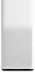

ioBroker mihome-air adapter
=================

This adapter allows you control the Xiaomi air purifier. The adapter and the widget are early alpha status.

### Description for the protocol
See here https://github.com/jghaanstra/com.robot.xiaomi-mi
and here https://github.com/OpenMiHome/mihome-binary-protocol/blob/master/doc/PROTOCOL.md
Currently the encryption token can be retrieved from the device. On other devices (e.g. vacuum) this is more difficult. I hope this won't be changed in future.

### Install

```
cd /opt/iobroker
npm i https://github.com/steinwedel/ioBroker.mihome-air.git
iobroker add mihome-air
```

## Widget


## Changelog

### 0.0.1 (2017-03-09)
* (gst666) initial commit
