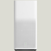

ioBroker mihome-air adapter
=================

This adapter allows you control the Xiaomi air purifier.

### Description
See here https://github.com/jghaanstra/com.robot.xiaomi-mi

The control commands are 80 bytes long.

### Install

```
cd /opt/iobroker
npm install iobroker.mihome-air
iobroker add mihome-air
```

## Widget


## Changelog

### 0.0.1 (2017-03-09)
* (gst666) initial commit
